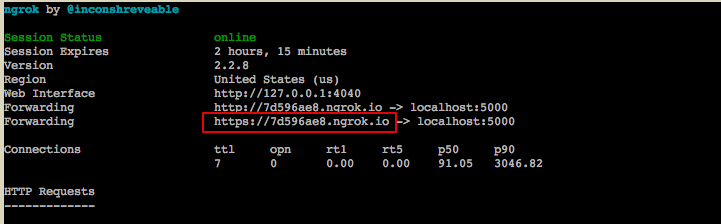
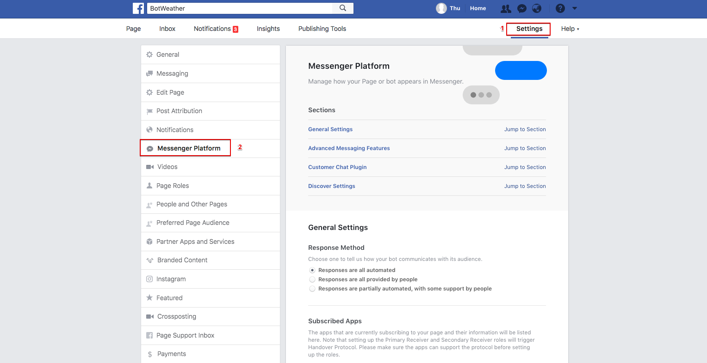
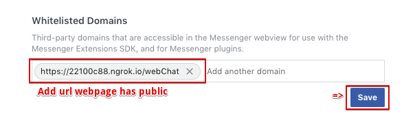

# Customer Chat Plugin (WebView)

To use the customer chat plugin, you must include the Facebook JavaScript SDK in the page where the plugin will be rendered.

## Setup Steps
To include the customer chat plugin on your webpage, do the following:

1. Create webpage public with nodejs and ngrok
- Make sure you have Node.js and the ngrok CLI installed.
- Create file index.js
    ```
    const fs = require('fs');
    const app = express()
    app.set('port', (process.env.PORT || 5000))
    app.get('/webChat', function(req, res){
        var view = {
        appId: ADD_ID,
        name: "",
        phone: "",
        address: ""
    };
    var html = Mustache.to_html(showWeb(), view);
        res.send(html);
    });

    function showWeb() {
        return fs.readFileSync(global.rootPath + '/index.html').toString();
    }
    ```
- Create file index.html: You must enter APP_ID(https://developers.facebook.com/apps) and FB_PAGE_ID(facebook page id)

    ```
    <body>
        <h1>Bot Weather</h1>
        <script>
            window.fbAsyncInit = function () {
                FB.init({
                    appId: APP_ID,
                    xfbml: true,
                    version: 'v2.12'
                });
                FB.AppEvents.logPageView();
            };
            (function (d, s, id) {
                var js, fjs = d.getElementsByTagName(s)[0];
                if (d.getElementById(id)) { return; }
                js = d.createElement(s); js.id = id;
                js.src = "https://connect.facebook.net/en_US/sdk.js";
                fjs.parentNode.insertBefore(js, fjs);
            }(document, 'script', 'facebook-jssdk'));
        </script>
        <div class="fb-customerchat" page_id="FB_PAGE_ID">
        </div>
    </body>
    ```
- Using ngrok your public node local
    ```
    $ ngrok http 5000
    ```

    

2. Whitelist the domain of your website
- For security reasons, the plugin will only render when loaded on a domain that you have whitelisted. Refer to whitelisted_domains reference to learn how to whitelist your domain programmatically.

- Businesses whose Messenger experience is provided by a service provider, will not have access to the page token generator in app settings because they do not own the Facebook app. In this case, you may add or remove whitelisted domains via Page settings. To whitelist a domain, do the following:

    - Click Settings at the top of your Page
    - Click Messenger Platform on the left

    

    - Edit whitelisted domains for your page in the Whitelisted Domains section

    


3. You can see more

    - [Customer Chat Plugin](https://developers.facebook.com/docs/messenger-platform/discovery/customer-chat-plugin)
    - [Quick Start](https://developers.facebook.com/quickstarts)
    - [Get facebook id](https://findmyfbid.com/)